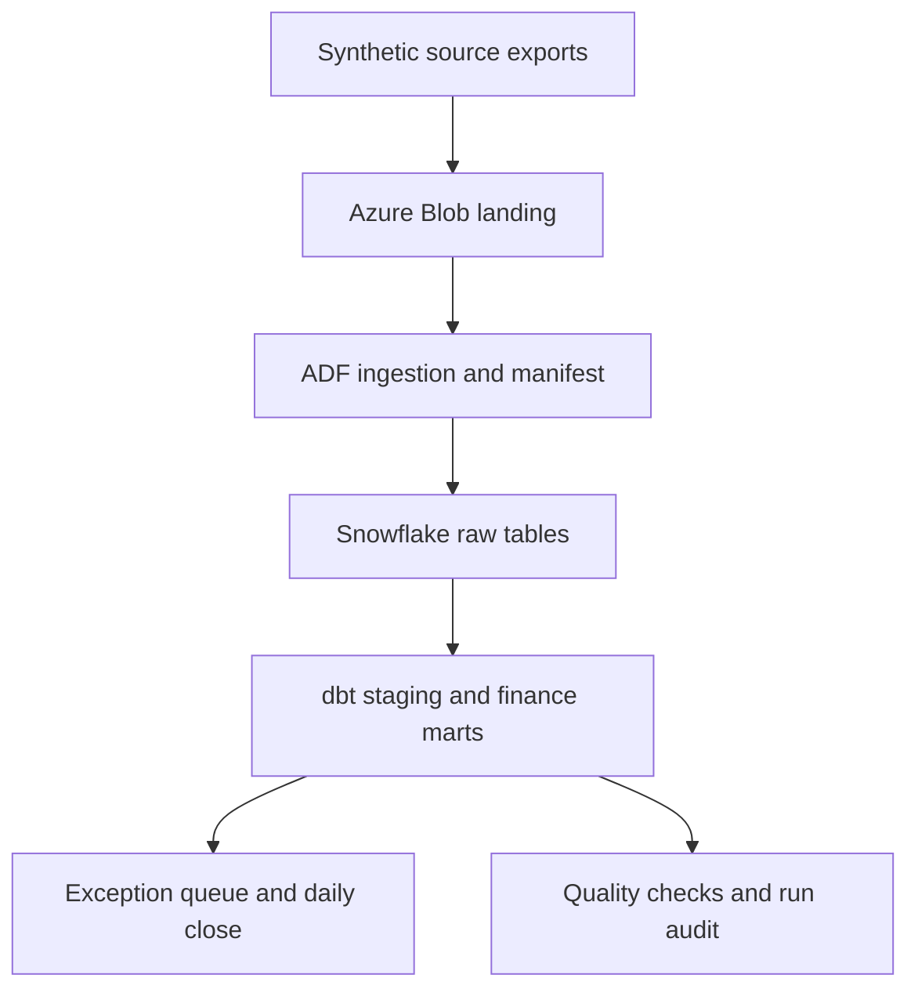

# Client engagement: payment settlement control

## Fictional client and problem

Northstar Commerce is a fictional UK online retailer taking GBP card payments through a processor. Finance closes daily cash manually from separate capture, settlement, refund and dispute extracts. A settlement can arrive days after capture. Some rows are missing, duplicated or corrected. Staff cannot tell a timing difference from a loss, and repeated spreadsheet joins have no reliable audit history.

**Decision to enable:** by 09:00 each business day, tell payment operations which transactions are settled, legitimately pending, short/over settled, refunded, disputed, orphaned, or structurally invalid. Show the amount at risk in GBP and the source evidence for each exception.

**Users:** payment operations analyst (case queue), finance controller (daily close), data platform owner (lineage and run health).

## Sources and contracts

| Feed | Grain | Essential fields | Expected behaviour |
| --- | --- | --- | --- |
| Merchant events | one immutable event ID | event_id, transaction_id, event_type (authorised/captured/refunded), event_time_utc, amount_minor, currency, merchant_id | Captures and refunds can be corrected by later events; duplicate delivery is possible |
| Processor settlements | one payout line ID | settlement_line_id, transaction_id, payout_id, settled_at_utc, gross_minor, fee_minor, net_minor, currency | Multiple partial lines per transaction; later arrivals and duplicate files possible |
| Disputes | one dispute event ID | dispute_id, transaction_id, opened_at_utc, reason, amount_minor, status | A dispute changes exposure, not the original captured amount |
| Payouts | one payout ID | payout_id, payout_date, bank_amount_minor, currency | Sum of settlement net must agree to bank payout within stated adjustment rules |

All amounts use integer minor currency units. First release supports GBP only. Never silently sum currencies or count authorisations as cash captured. Raw files retain batch ID, file hash, source row and received timestamp. No card PAN, real customer data or merchant secrets are generated or stored.

## Proposed architecture

ADF handles parameterised daily file transfer and fail/retry notifications. Snowflake stores immutable raw rows and curated tables. dbt manages source assertions, incremental transformations, lineage and published marts. These cloud components are **planned**, not implemented in the starter prototype.

## Reconciliation rules, in priority order

1. Quarantine missing/invalid identifiers, dates, currency or non-positive line amounts; source rejects remain counted.
2. Deduplicate by immutable event/line ID, recording repeated deliveries and rejecting conflicting payloads with the same ID.
3. Calculate net captured amount as captures less completed refunds. Keep authorisations and disputes separate.
4. Sum all settlement gross and fees for each transaction; check that each payout's sum of line net matches its bank payout amount.
5. Classify a capture with no settlement as `pending` within a configurable two-calendar-day window after capture, then `overdue_unsettled`.
6. Compare capture less refund with settlement gross at the agreed as-of time; label `short_settled`, `over_settled`, or `matched`. Preserve partial settlements and later corrections.
7. Label a processor line with no matching merchant transaction `orphan_processor_line`.
8. A dispute is a separate exposure flag, never a duplicate deduction from captured or settled amounts.
9. Restate affected days when late files arrive; publish both event-day and processing-day perspectives with a run watermark.

These are explicit business assumptions for the fictional client and should be discussed in the README. No claim of regulated financial controls or fraud detection.

## Acceptance criteria

- A deterministic fixture of at least 100,000 merchant events across 90 days, with known duplicate, missing, late, partial, refund, dispute and payout mismatch cases.
- On an unchanged rerun, accepted business-key counts and financial totals remain identical. Backfilling a day changes only affected transactions and downstream daily close totals.
- Every source row is accepted, quarantined, or marked duplicate. The counts reconcile to file manifests.
- Every capture receives one current status at an as-of timestamp; each unmatched processor line is independently visible.
- For each payout, line net equals bank amount or a named exception exists. Reconciliation arithmetic is in pence; no floating-point joins or sums.
- Tests cover file duplication, late arrival, partial settlement, refund-before/after settlement, orphan line, disputed capture, and two corrections to one transaction.
- Dashboard or exported report shows daily captured, settled, refunded and unmatched GBP, aging buckets, exception counts and drill-through source IDs. Metrics link to documented SQL definitions.
- Publish a run log, quality results, replay instructions, architecture and screenshots of a successful cloud run.

## Delivery stages and truthful evidence

| Stage | Deliverable | Evidence for skills bank |
| --- | --- | --- |
| 1: domain engine | richer event generator, local ingestion and reconciler, tests, model and exception report | Python, SQL, data modelling, payments reconciliation (after verification) |
| 2: Snowflake/dbt | raw load, incremental staging and marts, dbt source/model tests, docs and lineage | Snowflake and dbt (after real execution) |
| 3: Azure integration | ADF pipeline plus Blob landing, secure parameters, monitoring, backfill run | Azure Data Factory and Azure (after real execution) |
| 4: stakeholder handover | Power BI or equivalent dashboard, screenshots, results and cost/operations notes | End-to-end delivery and stakeholder communication |

## Current status

The local reference engine is implemented in `src/engagement.py`: synthetic captures, refunds, partial settlement lines, disputes, payouts, immutable raw-row checks, as-of reconciliation and four passing tests. The earlier `src/pipeline.py` is a minimal prototype. Cloud ingestion, dbt, historical restatements, dashboard and deployment evidence remain to be built. The current generator has 100,000 transactions rather than 100,000 merchant events; the actual count of source rows is reported at runtime.
