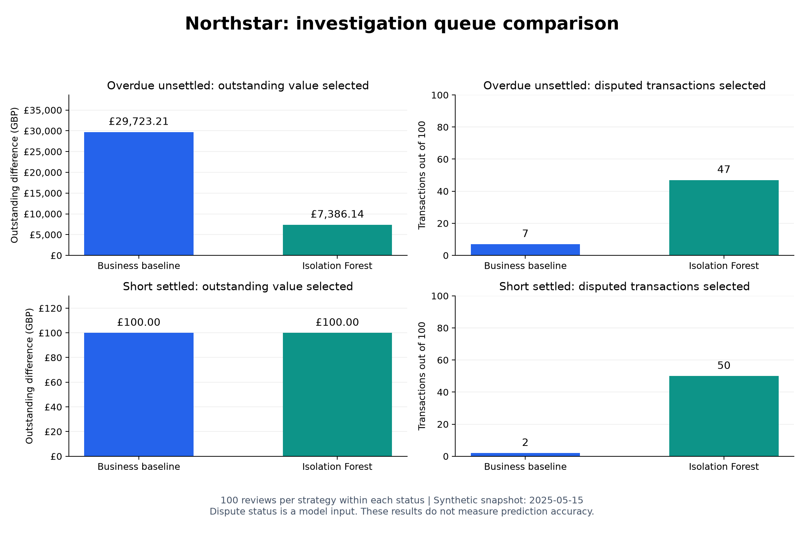

# Northstar Commerce | Payment settlement controls

Fictional client engagement. [Client brief and acceptance criteria](CLIENT_BRIEF.md). Data is entirely deterministic and synthetic; no real payment or customer records.

## Problem

Finance needs a daily view of captured sales, completed refunds, processor settlement lines and bank payouts. Late or mismatched records create an exception queue. An open dispute is shown separately from cash movements.

## Current delivery status

| Component | Status |
| --- | --- |
| Local 100,000-transaction generator and reference reconciler | Implemented |
| Integer-pence arithmetic, partial settlement lines, refunds, disputes, payout variance | Implemented |
| Immutable raw row ledger, rerun guard, as-of view, SQLite operational outputs, tests | Implemented |
| Azure Blob/ADF landing and monitoring | Planned, not deployed |
| Snowflake warehouse, database, schemas, raw tables, stage and CSV format | Deployed and verified in Snowflake on 28 September 2026 |
| dbt models/tests | Code prepared; account execution pending |
| Dashboard, replay of corrected files, managed exception workflow | Planned |

The earlier `src/pipeline.py` is a small prototype retained for comparison. The consultant-style local implementation is `src/engagement.py`.

## Run

From this directory, with Python 3.10+ and no third-party dependencies:

```bash
python3 src/engagement.py --generate
python3 -m unittest discover -s tests -v
```

A full default run generates 100,000 transactions across 90 event dates in `data/engagement/` and writes `data/engagement.sqlite`. A second run **without** `--generate` is idempotent. To generate a different fixture size, pass fresh `--data` and `--db` paths; changing immutable IDs in an existing ledger is deliberately rejected. Use `--as-of YYYY-MM-DD` for a historical cut. The report prints counts from the actual run. `data/` is ignored by Git.

## Output tables

- `raw_rows`: source name, immutable ID, JSON payload and SHA-256 digest.
- `reconciliation`: one current status per captured transaction with captures, refunds, settlement gross and dispute flag.
- `payout_control`: bank payout versus aggregate settlement net, in pence.
- `run_audit`: as-of date, source counts and exception count for each run.

## Caveats and next work

This reference implementation is a control demonstration, not payment accounting software. The synthetic settlement timing, fee and refund behavior are simplified. As-of payout comparison needs a payout effective date before historical closing is meaningful; the default run uses a post-period as-of date. Raw files are not yet stored in a cloud landing zone. The SQLite tables store only the current reconciliation state, so a production build needs a versioned historical mart and reprocessing workflow. No Snowflake, dbt or ADF expertise should be claimed solely from this code.

## Cloud checkpoint

The Snowflake foundation was deployed and verified on 28 September 2026.
All four synthetic feeds were loaded, validating 204,063 source rows.
The dbt run successfully built seven models, and all 22 data tests passed
with zero warnings or errors. Transaction reconciliation, payout controls,
and orphan settlement checks were inspected in Snowflake using an as-of
date of 2025-05-15.

## Verified Snowflake results

Validated using synthetic payment data with an as-of date of **2025-05-15**.

- Loaded **204,063 source rows** across four feeds.
- Built **7 dbt models**: four staging views and three analytical tables.
- Passed **22 dbt tests**, with zero warnings or errors.

### Transaction reconciliation

| Status | Transactions | Gross settlement difference |
|---|---:|---:|
| Matched | 90,617 | £0.00 |
| Overdue and unsettled | 5,264 | £789,093.20 |
| Short settled | 4,119 | £4,119.00 |
| Total | 100,000 | £793,212.20 |

The transaction match rate is **90.617%**. The remaining **9,383 transactions**
require investigation. Outstanding settlement amounts are not confirmed losses.

Reconciliation compares captured amounts minus refunds with processor gross
settlements. Processor fees are recorded separately.

### Payout and orphan controls

- **90 of 91 bank payouts** balance against their settlement lines.
- One payout, `payout-007`, has a **£0.50 difference**.
- One orphan settlement line, `line-orphan`, references `txn-unknown`:
  **£10.00 gross** and **£9.90 net**.

## Security

dbt connects through a dedicated Snowflake service account using RSA
key-pair authentication. The private key is encrypted and stored outside
the repository.

A dedicated dbt role reads raw data and builds analytical models.
A separate analyst role can read marts; access to RAW was tested
and denied with secondary roles disabled.

[Security implementation and verification](docs/security.md)

## ML exception prioritisation

Separate Isolation Forest models rank 9,383 synthetic reconciliation
exceptions within each status. Inputs include transaction amount,
capture age, refund ratio and dispute status.

A comparison of 100 investigations per status found:
- The business baseline selected more overdue outstanding value:
  £29,723.21 versus £7,386.14.
- ML selected more disputed overdue transactions: 47 versus 7.
- ML selected more disputed short-settled transactions: 50 versus 2.

The ML queues supplement business prioritisation. These exploratory
results do not establish prediction accuracy or fraud detection.



[Method, results, reproduction and limitations](docs/ml-exception-prioritisation.md)


